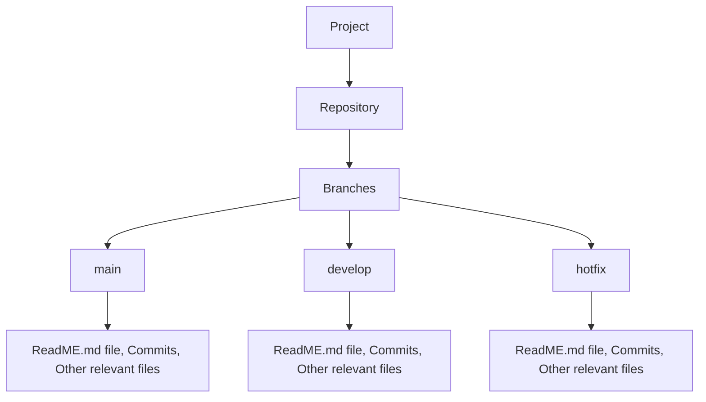

# CMPG-323-Overview
This repository is an overview of the work that must be done for the semester. It is one of the 5 that will be created in due time.

## Repositories to be created
- For project 2 which is based on API development, a repository named "CMPG323 Project 2" will created.
- For project 3 which is based on Standards & Patterns, a repository named "CMPG323 Project 3" will be created.
- For project 4 which is based on Testing & RPA, a repository named "CMPG323 Project 4" will be created.
- For project 5 which is based on Reporting & Monitoring, a repository named "CMPG323 5" will be created.

### Storage of credentials and sensitive information
Sensitive information that may no longer be of use will be deleted, reason being that they have the potential to cause problems in future. One common practice would be to encrypt file containing sensitive information and have backups. The backups could be stored in a different drive or secure cloud storage. 

The .gitignore file may be used in the above mentioned projects, to ignore files that do not have to committed and not track them. These files could have a .txt extension, which may contain certain instructions about the project and execution, or passwords for instance. 

### Intergration of project and repository context 

### The Branching Strategy to be used for all projects
The branching strategy to be used with each project includes having three branches. The first one being the main branch, which will help in tracking changes over time, creating pull requests, just to mention a few. The second one being the develop branch, which will entail any new developments or features. The last one being hotfix, which may be used to fix some code in the main branch. 
